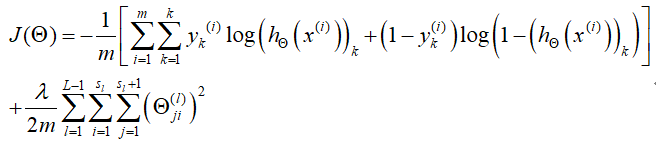

# 基本知识

## 机器学习

### 机器学习定义
    Arthur Samuel:机器学习是在进行特定编程的情况下,给予计算机学习能力的领域。

    Tom Mitchell：一个程序被认为能从经验E中学习，解决任务T，达到性能度量值P。也就是说，有了经验E后，经过P评判，程序在处理T时的性能有所提升。

    自我理解：机器学习实际上是通过对输入变量进行特定过程的计算（如梯度下降），确定所构建模型的一组参数，进而得到能够预测该类新数据的模型。
### 机器学习类型
    机器学习主要有两种类型，即监督学习和无监督学习。（注：早些时候——比如12年——监督学习是主流，但近年来更加倾向于探索半监督学习，这是监督学习和无监督学习的折中。）

#### 监督学习
    监督学习的基本思想是给定一个数据集，数据集中的每个样本都有相应的“正确答案”，程序通过对该数据集运用学习算法做出预测。

    监督学习主要包括回归问题和分类问题。前者是数值预测，后者是类别预测；也可以认为前者的输出值是连续的（比如商品价格、CPU利用率），而后者的输出值是离散的（种类1、种类2）。

#### 无监督学习
    无监督学习的基本思想是给定一个数据集,但该数据集没有任何的标签或只具有完全相同的标签（也就是说没有人为地给出“正确答案”），程序通过对数据集运用学习算法实现自动分类、预测等目标。聚类是无监督学习的一种。

### 机器学习算法

#### 单变量线性回归
    该算法应用于只含有一个特征或输入变量的场景。算法目标是根据给定的数据集预测出一个准确的输出值，此时的数据集被称为训练集。

    算法的表达式通常是一个线性函数，如f(x)=x0 + k*x。为衡量模型好坏，需建立代价函数，这里的x0和k作为参数，而模型所预测的值与训练集中实际值之间的差距就是建模误差，建模目标是目标便得到可以使建模误差的平方和最小的模型参数。

    最常用的代价函数是平方误差函数，常用的自动找出上述最小值的算法是梯度下降算法（得到的是局部最小值）。

#### 梯度下降
    将模型与数据集拟合时常用的算法。算法思想是随机选取一个参数组合来计算误差，然后通过梯度下降算法公式（尤其是学习率）基于当前参数和误差产生新的更接近局部最优的参数组合。

    除梯度下降之外，还有一些令代价函数最小的算法，如共轭梯度，局部优化法（BFGS），有限内存局部优化法（LBFGS）等。实际上，这些算法的收敛速度更快。

#### 多变量线性回归
    指构建含有多个输入变量、多个特征的模型对问题进行预测。

    算法的表达式同样是一个线性函数f(x)=k0*x0 + k1*x1 +...+ kn*xn，但含有n+1个参数（k0到kn）和n+1个变量（x0到xn）。可以认为模型的参数和变量均是一个n+1维向量。这里的代价函数是所有建模误差的平方和，求局部最优解同样是采用梯度下降算法，但在面对此类多维特征问题，必要时需要进行特征缩放，具体来说需要对样本数据进行某种处理或映射，使得根据数据描绘出来的图像在所有维度均较为“分散”。

    有时线性回归模型并不能很好拟合，这时可以考虑使用二次方或三次方模型等——实际上这里通过变量代换，例如y=x^3，也能转化为线性模型。具体采用什么模型，可以先根据数据画出图像，再根据图像特征来确定。

    此外，这里其实还可以运用正规方程算法，一次运算得到结果。但正规方程只适用于特征变量较少（小于1万）的线性模型，这里不详述。

#### 逻辑回归
    该算法是常用的解决分类问题的学习算法。

    对于二元逻辑回归，该算法的表达式可以理解为，以回归模型的表达式作为自变量，经逻辑函数处理，得到预测结果。即h=g(f(x))。这样做是为了得到介于0和1之间的预测值（线性模型可能产生远大于1或远小于0的值，这样的值不适合用于分类）。常用的逻辑函数是S型函数，即g(x)=1/(1+e^(-x))。

    拟合模型时，这里不能直接使用平方误差函数，因为平方误差函数在这里会得到非凸函数，可能产生较多的局部最大值或最小值，对梯度下降算法产生不良影响（可能会得到不那么好的局部最值）。因此这里使用cost(h,y)函数，其中h是上述二元逻辑回归模型提到的h(x)，y是预测分类结果。当y=1，cost(h,y)=-log(h)；当y=0，cost(h,y)=-log(1-h)。简化之后的代价函数为：cost(h,y)=-y*log(h) - (1-y)*log(1-h) 。

    拟合之前，这里同样可能需要考虑特征缩放。此外，为方便参数更新，这里更提倡使用向量化的实现，来计算h所需要的f(x)。

    对于二元逻辑回归于多元逻辑回归，可参考单变量线性回归与多变量线性回归。这里可以使用非常复杂的模型去适应具有非常复杂的形状的图像的数据。多类别分类问题（多元逻辑回归）可以归结为多个二元分类问题，基于该思想的方法也被称为“一对余”方法。

### 上述机器学习算法的缺陷及改善方法

#### 过拟合
    上述提到的机器学习算法（包括线性回归和逻辑回归）可能会出现过拟合问题。过拟合是指训练得到的模型过度拟合原始数据，而丢失了算法的本质——预测新数据。该问题出现时，模型对数据拟合较好，但预测能力较差。

    常见的解决思路是丢弃部分特征（这些特征对正确预测的贡献较小），或保留所有特征但减少参数大小（即正则化）。

#### 正则化
    正则化实际上是通过对代价函数引入正则化参数，对已有参数引入惩罚，使得拟合过程中选择较小的参数。引入方法和引入正则化参数之后的代价函数和预测函数在 http://www.ai-start.com/ml2014/html/week3.html 的7.2节有介绍，在线性回归和逻辑回归模型的运用分别在7.3和7.4节有介绍。

### 神经网络简介
    非线性多项式模型在多特征情况下，计算规模过于庞大（n个变量会产生n*n/2个特征），普通逻辑回归模型无法处理如此庞大的特征，故引入神经网络。神经网络最初产生的目的是制造能模拟大脑的机器，形象的说，就是“用一个单一的学习算法，去处理各种五花八门的事情”——与前述机器学习算法的不同之处在于，这些算法需要使用不同的学习算法去处理不同的事情。其背后的基本原理和出发点是，如果我们能将几乎任何传感器接入大脑，大脑的学习算法就能找出学习这些传感器数据的方法。

    大脑的神经网络是大量神经元相互链接并通过电脉冲来交流的一个网络，而人类思考的模型是神经元把自己收到的消息进行计算，并向其他神经元传递消息。由此，神经网络模型建立在很多神经元之上，每一个神经元又是一个个学习模型，这些神经元（也叫激活单元）采纳一些特征作为输出，并且根据本身的模型提供一个输出。特别之处在于，神经网络模型是分层的，是许多逻辑单元按照不同层级组织起来的网络，每一层的输出变量都是下一层的输入变量。在神经网络模型中，从左到右的算法称为前向传播算法（只是简单的输入-中间计算-输出），也叫正向传播算法。神经网络模型在进行计算时可以理解为使用向量化的方法替代了前述线性回归模型中f(x)的循环计算。

    倘若只看神经网络模型的最后两层（输出层及其直接连接的层），可以发现它就像是逻辑回归模型，但其输出层直接连接的层的神经元具备更高级的特征值（由更前面的层产生），能够更好地预测新数据，这就是神经网络相对于线性回归和逻辑回归的优势。

    对于每个神经元，后一层的一个神经元实际上相当于逻辑回归模型的h或者线性回归模型的f，前一层的全部神经元则相当于输入变量x1到xn（另外一个变量x0是隐藏的）。这就意味着，通过前一层到后一层的映射，每一个后层神经元实际上就实现了对前一层全部神经元的某个特征的提取。这里每个映射的一组参数也被称为输入变量的权重。

    神经网络模型的代价函数为： h_θ (x)∈R^K ，(h_θ (x))_i=i^th output，公式如图。

 
    上述公式使用的是向量而非单个数值，因为神经网络模型的输出变量通常有很多个。

    上面提到神经网络的正向传播算法，这里介绍反向传播算法，在计算代价函数的偏导数的时候，可以采用该算法。反向传播算法首先计算最后一层的误差，再一层一层反向求出各层的误差。在实际执行时，首先用正向传播方法计算出每一层的激活单元，利用训练集的结果与神经网络预测的结果求出最后一层的误差，然后利用该误差运用反向传播法计算出直至第二层的所有误差。

    值得一提的是，上面多次提到梯度下降算法寻找到的是局部最优解，那么可以采用梯度检验去验证梯度下降算法得到的是不是最优解（尤其是神经网络中）。此外，神经网络需要使用随机初始化，不能采用所有参数为0的初始化。

    使用神经网络的步骤：

    第一步，确定网络结构。首先，确定第一层和最后一层的神经元数量。第一层的神经元数量就是训练集的特征数量，最后一层的神经元数量就是训练集的结果的类的数量（分类数量）。其次，确定隐藏层（中间层）的层数。最后，确定每个隐藏层的神经元数量，这里通常是越多越好，但要保证所有隐藏层的神经元数量一致——向量化之后可以不一致。

    第二步，训练神经网络。1，对参数进行随机初始化。2，使用正向传播方法计算所有的h(x)。3，编写计算代价函数J的代码。4，使用反向传播方法计算所有偏导数。5，利用数值检验方法检验这些偏导数。6，使用优化算法（如梯度下降、BFGS）来最小化代价函数。

    第三步，使用神经网络进行预测。若预测效果较差，则需要对训练集进行预处理或对模型进行调整。

## 神经网络

### 神经网络基本类型
    除了标准神经网络以外，神经网络的其他类型包括卷积神经网络CNN和循环神经网络RNN等——这些神经网络都是专注于特定类别的场景的。CNN常用于图像领域，RNN常用于处理序列数据（尤其是时间序列）。

### 监督学习与神经网络
    目前，绝大多数实用的、有经济价值的神经网络所采用的学习类别均为监督学习（监督学习的定义在机器学习部分有介绍）。但半监督学习正在兴起。

### 深度学习与神经网络的关系
    通常把对神经网络的训练过程（事实上应该是深度神经网络的训练过程）称为深度学习。实际上，深度学习算法只是神经网络的一部分（当然，是很重要的部分）。

    深度学习的火热涉及数据规模、计算量和算法创新，而神经网络最终的性能更多的是取决于工程选择特征方面的能力以及算法处理方面的细节——例如，激活函数从S型函数改为ReLU函数。深度学习对于神经网络的最大意义实际上不在于让神经网络规模变大，而在于极大提高了模型修改和算法创新的效率。

### 神经网络的几种重要函数
    神经网络的构建与训练涉及假设函数、代价函数和损失函数、激活函数。其中前两种函数在机器学习部分有介绍，而损失函数是用来衡量算法的运行情况的函数，又叫做误差函数。

    损失函数和代价函数的区别之处在于，损失函数衡量的是算法在单个训练样本的表现，而代价函数衡量的是算法在全部训练样本的表现。

    当前神经网络建模通常不使用S型函数，也不使用tanh函数（哪怕它优于S型函数），而是使用ReLU函数。不过这要视实际场景而定。一个经验法则是：如果输出是0、1值（二分类问题），则输出层选择sigmoid函数，然后其它的所有单元都选择ReLU函数。

### 神经网络编程基础
    主要是在逻辑回归模型的基础上，了解求导（尤其是使用计算图求导），还有向量化——使用向量化方法比for循环快数十倍甚至数百倍。此外就是Python的使用，这里特指神经网络方向的使用（如向量运算、深度学习库函数调用），而非普通编程。

### 浅层神经网络与深层神经网络
    深层神经网络与浅层神经网络的区别在于隐藏层数量——前者的隐藏层层数很多，后者的隐藏层层数较少（通常只有几层）。另外，前者每个隐藏层包含的神经元数量相对较少，后者的每个隐藏层包含的神经元数量通常较多（尤其是解决复杂问题时）。

    与浅层神经网络相比，深层神经网络的优势在于，很多数学函数用深层网络计算比用浅层网络计算要简单得多，另外很多函数只能用深层网络实现。但有时候神经网络深度并非越深越好，更合理的方法是从逻辑回归模型开始、从一两个隐藏层开始，把隐藏层数量当成参数、超参数一样去调试，去寻找比较合适的深度。

    由于深度学习与深层神经网络密切关联，深度学习有时也被认为是与深度神经网络相同的概念。

### 搭建深度神经网络
    详细步骤见 http://www.ai-start.com/dl2017/html/lesson1-week4.html 4.6节。

    大致思路是：对某一层，先考虑正向传播步骤，确定各层的激活函数和映射函数，以及考虑要缓存的结果（用于反向传播）；再考虑反向传播步骤，主要是计算偏导数以实现梯度下降学习。接着把输入特征放到第一层并计算第一层的激活函数，然后把第一层的结果喂到第二层（作为第二层的输入）并计算激活函数……以此类推，最后到了输出层得到输出，正向传播部分完成。然后从最后一层开始，反向计算梯度（需要用到缓存结果），推导出上一层的导数，以此类推，一直到倒数第二层，反向传播部分完成。

    深度神经网络还要规划参数和超参数，比如学习率、梯度下降法循环的数量、隐藏层数目、隐藏层单元数目、激活函数的选择等。它们因为控制了最后的参数结果生成，因此被称为超参数。

### 改善深度神经网络

## 序列模型
